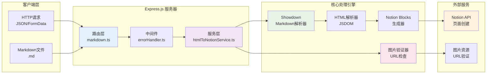
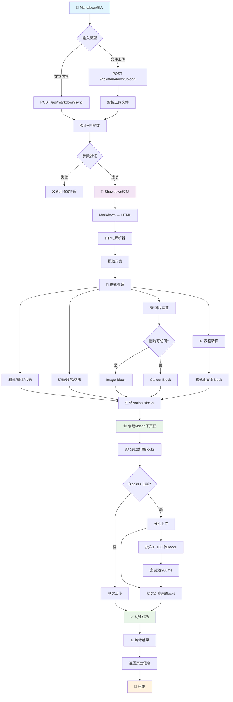

# Markdown to Notion API

将Markdown内容直接转换并创建为Notion子页面。
使用Showdown库提供高质量的Markdown解析和丰富的格式支持。

## ✨ 功能特性

- 📝 **智能Markdown转换**: 使用Showdown库支持丰富的Markdown语法
- 🎯 **子页面创建**: 自动在指定Notion页面下创建结构化的子页面
- 📁 **文件上传**: 支持直接上传.md文件并自动转换
- 🎨 **格式丰富**: 支持表格、代码块、引用、列表、图片等各种格式
- 🔗 **图片处理**: 智能验证图片URL可访问性
- 🛡️ **类型安全**: 完整的TypeScript类型定义
- 🚀 **RESTful API**: 简洁的API设计，易于集成

## 🔧 支持的Markdown语法

- ✅ 标题 (H1-H6)
- ✅ **粗体** / *斜体* / ~~删除线~~
- ✅ `行内代码` 和代码块
- ✅ 引用块
- ✅ 有序/无序列表
- ✅ 表格
- ✅ 图片和链接
- ✅ 任务列表
- ✅ Emoji表情 :rocket:


## 📦 安装和设置

### 1. 克隆并安装依赖

```bash
git clone <repository-url>
cd md-to-notion
npm install
```

### 2. 启动服务

#### 开发模式
```bash
npm run dev
```

#### 生产模式
```bash
npm run build
npm start
```

服务将在 `http://localhost:5858` 启动

### 3. Notion设置

1. **创建Notion Integration**：
   - 访问 https://www.notion.so/my-integrations
   - 点击 "New integration"
   - 填写基本信息并创建
   - 复制 "Internal Integration Token"

2. **设置Notion页面**：
   - 在Notion中创建一个新页面作为父页面
   - 点击页面右上角的 "••• " → "连接" → 选择你的Integration
   - 复制页面ID（从URL中获取）

**获取页面ID的方法：**
```
URL示例: https://www.notion.so/workspace/Page-Title-1d65b7e27560808ca3a2e1912885e60e
页面ID: 1d65b7e2-7560-808c-a3a2-e1912885e60e
```

## 🚀 API使用

### 基础信息

- **基础URL**: `http://localhost:5858`
- **Content-Type**: `application/json`

### 1. 创建Markdown子页面

```bash
POST /api/markdown/sync
```

**请求参数：**
```json
{
  "content": "# 我的文章\n\n这是markdown内容...",
  "notion_api_key": "ntn_xxxxxxxxxxxxxxxxxx",
  "notion_page_id": "1d65b7e2-7560-808c-a3a2-e1912885e60e",
  "title": "文章标题（可选）"
}
```

**响应示例：**
```json
{
  "success": true,
  "message": "notion 页面创建成功",
  "data": {
    "success": true,
    "notionPageId": "新创建的子页面ID",
    "title": "文章标题",
    "timestamp": "2024-01-01T12:00:00.000Z",
    "blocksCreated": 15,
    "imagesProcessed": 2
  }
}
```

### 2. 上传Markdown文件

```bash
POST /api/markdown/upload
```

**请求参数：**
- Content-Type: `multipart/form-data`
- `file`: Markdown文件 (.md)
- `notion_api_key`: Notion API密钥
- `notion_page_id`: 父页面ID
- `title`: 自定义标题（可选）

### 3. API文档

```bash
GET /api/markdown
```

获取完整的API使用说明。

### 4. 健康检查

```bash
GET /health
```

检查服务运行状态。

## 📝 使用示例

### 基础内容同步

```bash
curl -X POST http://localhost:5858/api/markdown/sync \
  -H "Content-Type: application/json" \
  -d '{
    "content": "# 技术文档\n\n## 概述\n\n这是一个**重要**的技术文档。\n\n### 代码示例\n\n```javascript\nconsole.log(\"Hello World!\");\n```\n\n> 注意：这是一个引用块\n\n- 功能一\n- 功能二\n- 功能三",
    "notion_api_key": "your_notion_api_key",
    "notion_page_id": "your_parent_page_id",
    "title": "我的技术文档"
  }'
```

### 文件上传

```bash
curl -X POST http://localhost:5858/api/markdown/upload \
  -F "file=@document.md" \
  -F "notion_api_key=your_notion_api_key" \
  -F "notion_page_id=your_parent_page_id" \
  -F "title=上传的文档"
```

## 🎯 高级功能

### 智能图片处理

系统会自动验证图片链接的可访问性：
- ✅ 可访问的图片：直接嵌入Notion
- ❌ 不可访问的图片：显示为带说明的提示块

### 代码块语言支持

支持多种编程语言的语法高亮：
- JavaScript/TypeScript
- Python
- Java
- C/C++/C#
- Go, Rust, PHP
- HTML/CSS/SCSS
- SQL, Shell, YAML
- 等等...

### 表格处理

Markdown表格会转换为格式化的文本块，保持表格结构的可读性。


## 🛠️ 开发脚本

```bash
# 开发模式（支持热重载）
npm run dev

# 构建项目
npm run build

# 生产模式运行
npm start

# 监听模式（自动重启）
npm run watch
```

## 📊 技术栈

- **运行时**: Node.js + TypeScript
- **Web框架**: Express.js
- **Markdown解析**: Showdown
- **Notion集成**: @notionhq/client
- **文件上传**: Multer
- **开发工具**: ts-node, nodemon

## 🔒 错误处理

API使用标准HTTP状态码和统一的错误格式：

**错误响应示例：**
```json
{
  "success": false,
  "error": {
    "message": "缺少notion_api_key参数",
    "stack": "错误堆栈信息（开发模式）"
  }
}
```

**常见错误码：**
- `400`: 参数错误（缺少必需参数等）
- `500`: 服务器内部错误

## 🤝 贡献

欢迎提交Issue和Pull Request来改进这个项目！

### 🏗️ 技术架构图



## 🔄 核心流程图



## 📄 许可证

MIT License

---

> 💡 **提示**: 这个API服务专为处理中文内容优化，支持完整的Unicode字符集和中文格式。 